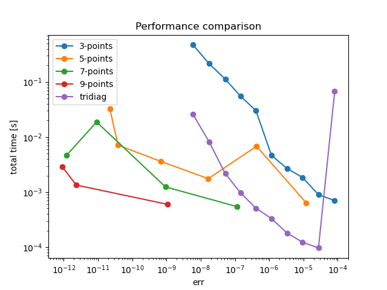

Exploring the work-error balance of difference solvers for a 1D partial differential equation.


# Motivation
As a student in high performance computing, I'm training to produce optimized codes for numerical methods. Here are some details at the implementation level:
  * optimizing cache usage
  * using vectorized instructions
  * removing redundant work or data movement

however, not much attention is put on why that numerical method or algorithm is chosen in the first place. The most plausible explanation is that we restrict the domain of exploration down to a single method because of limitations in time and skill, but we can't forget that the ultimate goal of our craft is exploring the **work-error** balance of solving procedures.

This small demo shows that one can get to a better solution (in the work-error sense) by using sophisticated methods, rather than heavily optimized naive methods. The takeaway here is that every method has its own strengths and weaknesses and that the optimal choice is problem dependent.


# High order finite differences
The finite difference method is a simple but powerful technique for solving regular PDE problems. It shines when:
  * the domain is an hypercube
  * the mesh is equispaced
  * the solution is regular

in general, 3-point formulae should be more robust to numerical errors but should be slower to converge than higher-order formulae (i.e a 9-point stencil)


## Target problem
Solve the PDE
  * $u'' + u = 0$ in $[0,1]$
  * $u(0) = 0$
  * $u(1) = 1$

for which $\frac{sin(x)}{sin(1)}$ is the exact solution.


# Technical details
The stencils that discretize the operator are obtained by solving a particular Vandermonde system, this is somewhat unconventional as finite difference stencils are obtained with [Fornberg algorithm](https://www.colorado.edu/amath/sites/default/files/attached-files/mathcomp_88_fd_formulas.pdf). Nevertheless the calculations are to be made in exact arithmetic as we want the stencils to be accurate as possible as the Vandermonde matrix is ill-conditioned. Since the coefficients are integer, rational arithmetic is exact.


## A good rational type
The stencil calculations are made at runtime, so we will need a library that implements rational arithmetic. This may seem a simple task and one is tempted to roll out a custom rational type library as it's very common on github, but we need a critical feature.

Rational arithmetic is built on integer arithmetic, which could overflow. It's possible that some calculation could generate overflows even if the result is representable. Some techniques are employed to remove this risk like in the [boost rational implementation](https://www.boost.org/doc/libs/latest/libs/rational/rational.html), but in general it is recommended to:
  * provide an integer type with unlimited precision, or
  * provide an integer type that can signal overflow

those are not easy features to support and will require pretty heavy dependencies. Since we need a rigorous comparison between solver orders, I'll accept the boost dependency.


## Solver zoo
I needed to gather all the solver implementations under the same interface. This makes the experiment code declarative and it has allowed me to remove redundancies in the solver construction. In my design a solver is constructed for every problem size and stencil-based solvers are constructed with the desired stencil. By using the *factory pattern* I declare a stencil object that computes once the stencil and builds solver objects when required:

```c++
Stencil solver_factory(5);

for (...) {
    std::unique_ptr<Solver> solver = solver_factory.generate_solver(problem_size);

    solver->solve(...);
}
```


## Incremental builds
I needed to isolate the development of various solvers. By assigning a translation unit for each solver, I limit the amount of code that gets recompiled at every change. This was required because Eigen libraries are slow to compile and I wanted a fast iteration cycle (still ~4 seconds for an optimized full build!)


## Optimized solvers
I decided to use the LAPACK tridiagonal solver for the implementation of the *"heavily optimized method[s]"*. This wasn't the focus of the project and I'm assuming `dgtsv` to be a state of the art implementation.


# Dependencies and usage
This project depends on:
  * Eigen3 (required)
  * some form of boost for the exact stencils (only if `-DUSE_EXACT_STENCILS:BOOL=ON`)
  * lapacke

lapacke is tricky because there is no `find_package(LAPACKE)`. For ubuntu like systems, make sure to have the `liblapacke-dev` package installed.


```bash
# classic cmake style build
git clone https://github.com/FattiMei/high-order-fd
cd high-order-fd
mkdir build
cd build

cmake .. -DCMAKE_BUILD_TYPE=Release -DUSE_EXACT_STENCILS:BOOL=ON
make -j

# the high-order target performs the solver testing
./high-order | tee out.csv
python ../analysis.py out.csv
```


the python script produces the work-error plot you see at the top of this page.
