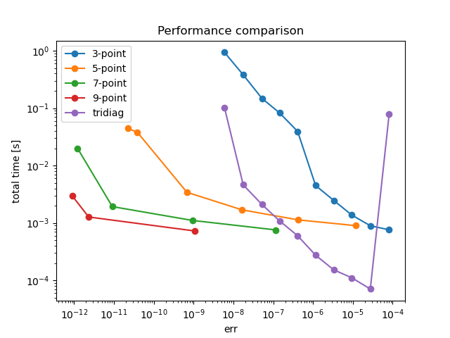
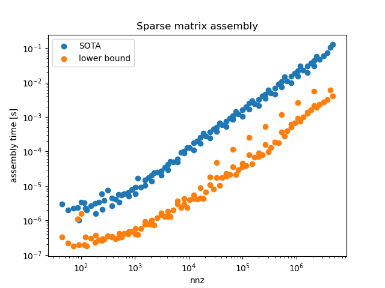
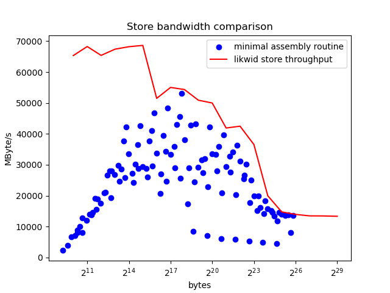
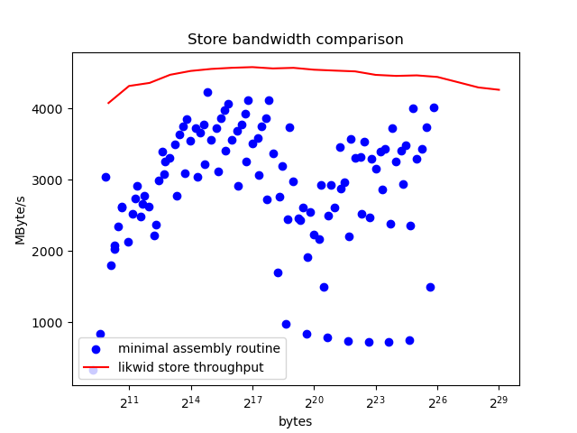

> are higher order methods more efficient from a work-error perspective?

## State of things
When discretizing the 1D differential operators like the laplacian, the 3-point stencil is the first thing that comes to mind. Partly because it serves a didactical purpose when introducing new students to the topic.

Since it's quite easy to generate high order finite differences, I wonder if paying a little cognitive cost when dealing with a more sophisticated method could yield a better overall performance. This is also a change to do a proper solver comparison using work-error plots.

### Tradeoffs of higher order methods
  * require regularity in the domain
  * require regularity in the solution (but still I haven't produced an example in which those methods fail)
  * more affected by numerical errors
  * higher cognitive cost, less chances for optimization

## Experiment description
I solve this problem
  * $u'' + u = 0$ in $[0,1]$
  * $u(0) = 0$
  * $u(1) = 1$

for which $\frac{sin(x)}{sin(1)}$ is the exact solution, on increasingly bigger regular meshes. For each problem size, I compare the performance of multiple direct solvers (3-point, 5-point, 7-point, 9-point) by measuring the exact error and the total runtime (assembly time + solve time).

An additional optimized tridiagonal solver (lapacke `dgtsv`) is integrated, this to provide the best known 3-point solver (but there is still room for improvement... stay tuned)

### Design decisions
**(exact arithmetic)**: high order stencils are not usually tabulated, so I had to compute them using a method presented in [[finite-differences]]. To have the highest possible accuracy for the coefficients, I had to use exact arithmetic with `boost::rational<IntType>`. This dependency is better than rolling a custom rational number implementation.

**(oop modeling)**: I thought about producing an hierarchy of classes for modeling the solver behavior with the goal of describing the experiments in a declarative fashion. This was later simplified into a macro... All the solvers share the same interface, although this is not explicit, I could probably use C++20 concepts to enforce the interface, but it will provide little value to the project.

**(incremental builds)**: the Eigen library is not friendly build times, so I had to break the project into many independent translation units to improve the developer experience.

## Comments on the results
The results are in line with the expectations: if high accuracy is required, then high order methods are more efficient than scaling simpler methods. Simple methods have still a place in the engineer toolbox as they are robust and pretty fast for qualitative solutions. Keep in mind that this experiment is extremely limited (real world problems are 3d and irregular), but still we can extract some insights.

# Dependencies and usage
This project depends on:
  * Eigen3 (required)
  * some form of boost for the exact stencils (only if `-DUSE_EXACT_STENCILS:BOOL=ON`)
  * lapacke

lapacke is tricky because there is no `find_package(LAPACKE)`. For ubuntu like systems, make sure to have the `liblapacke-dev` package installed.


```bash
# classic cmake style build
git clone https://github.com/FattiMei/high-order-fd
cd high-order-fd
mkdir build
cd build

cmake .. -DCMAKE_BUILD_TYPE=Release -DUSE_EXACT_STENCILS:BOOL=ON
make -j

# the {pareto, assembly, throughput} targets perform tests
make pareto
```

# Sparse matrix assembly
Eigen offers the class `SparseMatrix<T>` to manipulate sparse matrices. Users of Eigen sparse matrices require the matrix to be in *column-major, compressed format*, which is a CSC format. There are many ways of filling a sparse matrix:
  * starting from a set of triplets (i,j,val)
  * `coeffRef`
  * `insert`

out of those, `insert` should be the fastest (not counting the internal methods of `SparseMatrix`, not explicitly documented), but there is another fact to consider. The fastest implementation assumes the entries are inserted according to the column/row-major format. In this case the entries should be inserted for every column by increasing row indices. This is somewhat incovenient because it's easier to assemble by rows. To settle any argument, I produced a phony assembly implementation mimicking the data access pattern of the idealized procedure. Preliminary results shows an important difference, below a plot



## Lower bounds
The assembly code (not counting the allocations that must be done in any case) must dump on the memory the matrix data. This is a universal constant. With this experiment I compare the minimal assembly procedure with the results of a store benchmark from the likwid project. Below results in single core from
  1. 13th Gen Intel(R) Core(TM) i5-1334U (12) @ 4.60 GHz
  2. ARM A55 rk3566 (4) @ 1.80 GHz




